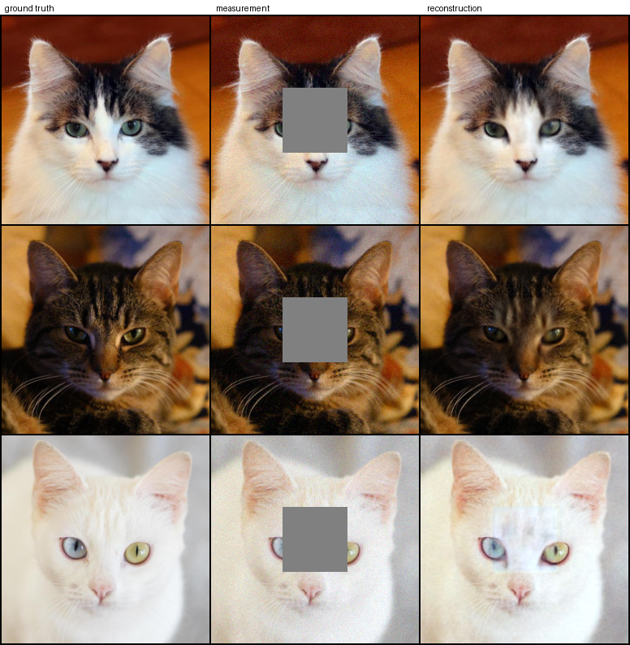

# SNaP

<!-- TODO(before publishing): spell the acronym out in the line below, e.g.
     "**S**ource-**N**oise-**a**ware **P**osterior ..." -- I did not want to invent it. -->

Reference implementation of **SNaP**, a **one-step** posterior sampler for linear inverse
problems.
Instead of transporting white noise to an image, the flow starts from the *exact Gaussian
posterior* of the measurement, so a single network evaluation already lands near the data.
Inpainting, box inpainting, Gaussian deblurring, super-resolution and multi-coil CS-MRI
are all handled by the same objective and the same network.



*AFHQ-Cat 256×256, centered 80×80 box inpainting, four averaged posterior draws, produced
by `python demo.py --model afhq_box --n 3 --M 4`. Images: AFHQ (CC BY-NC 4.0).*

```bash
git clone https://github.com/<OWNER>/<REPO> && cd <REPO>
pip install -r requirements.txt
python scripts/download_data.py celeba            # 1.4 GB, into data/celeba
python scripts/download_checkpoints.py --group celeba   # 175 MB, into checkpoints/
python demo.py --model celeba_sr                  # -> outputs/demo_celeba_sr/grid.png
```

That last command prints PSNR/SSIM/LPIPS next to the paper's numbers and writes a
ground-truth / measurement / reconstruction strip you can look at.

## Method

For `y = A x + n`, `n ~ N(0, sigma_n^2 I)`, and a Gaussian working prior `x ~ N(0, tau^2 I)`,
the flow's source is the posterior itself:

```
x1 ~ N(m_y, tau^2 W),   m_y = A^T (A A^T + lam I)^-1 y,
W = I - A^T (A A^T + lam I)^-1 A,   lam = sigma_n^2 / tau^2.
```

It is drawn with a square-root-free randomize-then-optimize sampler that never forms
`W^{1/2}` and needs only `A`, `A^T` and one measurement-space solve `(A A^T + lam I)^-1`,
which each operator implements in closed form (inpainting `rhs/(M+lam)`, denoising and SR
`rhs/(1+lam)`, deblurring by FFT, MRI by CG). Training regresses the MeanFlow identity
`V = u + (t - r) sg[du/dt]` against the path velocity, with `du/dt` a forward-mode JVP;
the network is conditioned on `[A^T y, coverage]` concatenated onto the interpolant.
Sampling is one network call at `(r=0, t=1)`; `--k > 1` composes the same learned average
velocity over a partition of `[0,1]` with no retraining.

Because each draw is a posterior *sample*, averaging `M` of them (with the measurement
held fixed) estimates the posterior mean and trades LPIPS for PSNR/SSIM -- that is the
`M=1` vs `M=100` gap in the tables below, not a tuning artifact.

## Pretrained models

Twelve models, 2.4 GB in total, hosted on Hugging Face at
[ShirinShouhstari/snap-weights](https://huggingface.co/ShirinShouhstari/snap-weights).
You don't need to visit it: `scripts/download_checkpoints.py` fetches from there and
verifies every file's sha256. `--list` shows the same table live, and `--group celeba` /
`--group afhq` / `--group brain` fetch one family.

| model | problem | one-step (M=1) | averaged | input |
|---|---|---|---|---|
| `celeba_inpaint` | CelebA 128, 70% pixels missing, σ=0.01 | 31.98 / 0.928 / 0.018 | 34.84 / 0.960 / 0.019 | 11.96 |
| `celeba_box` | CelebA 128, centered 40×40 box, σ=0.05 | 30.73 / 0.934 / 0.021 | 33.69 / 0.961 / 0.022 | 22.33 |
| `celeba_deblur` | CelebA 128, Gaussian blur σ<sub>b</sub>=1.0, k=61, σ=0.05 | 32.92 / 0.919 / 0.019 | 35.91 / 0.956 / 0.030 | 27.24 |
| `celeba_sr` | CelebA 128, ×2 super-resolution, σ=0.05 | 31.27 / 0.903 / 0.023 | 34.16 / 0.946 / 0.031 | 11.68 |
| `afhq_inpaint` | AFHQ-Cat 256, 70% pixels missing, σ=0.01 | 30.49 / 0.854 / 0.066 | 33.25 / 0.913 / 0.059 | 13.25 |
| `afhq_box` | AFHQ-Cat 256, centered 80×80 box, σ=0.05 | 26.47 / 0.892 / 0.054 | 29.54 / 0.925 / 0.069 | 21.57 |
| `afhq_deblur` | AFHQ-Cat 256, Gaussian blur σ<sub>b</sub>=3.0, k=61, σ=0.05 | 26.25 / 0.674 / 0.160 | 29.33 / 0.789 / 0.320 | 23.58 |
| `afhq_sr` | AFHQ-Cat 256, ×4 super-resolution, σ=0.05 | 26.07 / 0.704 / 0.131 | 28.99 / 0.811 / 0.187 | 11.97 |
| `brain_r4_20db` | fastMRI brain, CS-MRI, R=4, 20 dB | 32.07 / 0.890 | 32.90 / 0.909 | 25.35 |
| `brain_r4_30db` | fastMRI brain, CS-MRI, R=4, 30 dB | 32.89 / 0.899 | 34.13 / 0.926 | 25.61 |
| `brain_r8_20db` | fastMRI brain, CS-MRI, R=8, 20 dB | 28.11 / 0.819 | 29.35 / 0.851 (M=16) | 21.85 |
| `brain_r8_30db` | fastMRI brain, CS-MRI, R=8, 30 dB | 29.12 / 0.845 | 30.15 / 0.871 | 22.00 |

PSNR / SSIM / LPIPS on 100 held-out test images, one SNaP step (k=1); "averaged" is the
posterior mean over M=100 draws (M=16 where marked), and "input" is the PSNR of the
degraded measurement `A^T y`. MRI is scored on the magnitude with a per-slice dynamic
range and has no LPIPS (it is an RGB metric). The four MRI models are operator-specific:
each was trained for one (acceleration, measurement-SNR) cell and is only valid there.

Each checkpoint ships with the exact config it was trained under, in
`configs/pretrained/<model>.yaml`, so evaluation cannot drift from training.

## Data

```bash
python scripts/download_data.py celeba      # 202,599 aligned images -> train/validation/test
python scripts/download_data.py afhq        # AFHQ-Cat 5,153 / 500 / 100
python scripts/download_data.py all --verify-only    # re-check an existing install
```

Both are fetched from public mirrors of the **original** files and then checked against
`scripts/data_manifest.json` -- file counts, a hash of the sorted file list, and the
sha256 of sampled images. The published numbers were produced on exactly those bytes, so
a mirror that silently re-encodes its JPEGs fails the check instead of shifting every
metric. Downloads resume if interrupted; pass `--archive` to install from a zip you
already have.

Splits: CelebA uses the official partition (train `000001-162770`, validation
`162771-182637`, test `182638-202599`); AFHQ-Cat uses `afhq/train/cat` and `afhq/val/cat`,
with the first 100 validation images in sorted order as the fixed test subset.

fastMRI is credentialed and cannot be downloaded automatically -- see
[docs/DATA.md](docs/DATA.md). Dataset licenses are the original ones (CelebA:
non-commercial research only; AFHQ: CC BY-NC 4.0); this repository ships no dataset images.

## Evaluate

```bash
# single-draw metrics + per-image PNGs on the test split
python eval.py --config configs/pretrained/celeba_sr.yaml \
    --ckpt checkpoints/celeba_sr.pt --n 100 --k 1

# the sample-averaged curve the tables report (M draws, measurement held fixed)
python eval_avg.py --config configs/pretrained/celeba_sr.yaml \
    --ckpt checkpoints/celeba_sr.pt --n 100 --M 1 4 16 100 --out outputs/eval_celeba_sr

# MRI (magnitude / dynamic-range convention)
python eval_avg_mri.py --config configs/pretrained/brain_r8_30db.yaml \
    --ckpt checkpoints/brain_r8_30db.pt --ids data_splits/brain_test100.txt \
    --M 1 4 16 --out outputs/eval_brain
```

For MRI, pass `--ids data_splits/brain_test100.txt`: the reported numbers use that fixed
100-slice subset, stratified over all 77 test volumes, while `--n 100` would take the
first 100 slices (~14 patients).

`eval_avg.py` draws `M` samples per image with the measurement **held fixed** and scores
their mean; the `M` values are prefixes of one pool of draws, so the curve is monotone by
construction. It also reports the inter-draw spread, which is what distinguishes a
sampler from a regressor -- single-draw PSNR rewards a collapsed one.

## Train

```bash
# CelebA: one config, all operators; tau is per operator (table at the top of the file)
python run.py --config configs/celeba.yaml \
    --set experiment.stage=sr snap.tau=0.1 experiment.run_id=my_sr

# AFHQ-Cat 256
python run.py --config configs/afhq.yaml \
    --set experiment.stage=box_inpainting snap.tau=0.5 experiment.run_id=my_box

# brain CS-MRI (build the slice cache first -- see docs/DATA.md)
python run.py --config configs/mri_brain.yaml --set experiment.run_id=my_brain
```

`configs/celeba.yaml`, `configs/afhq.yaml` and `configs/mri_brain.yaml` carry the settings
the released checkpoints were trained with, so these commands retrain them from scratch.
Multi-GPU is set by `distributed.gpus`; a run writes checkpoints, the resolved config, a
snapshot of the code that produced it, sample previews and a log to
`<output_root>/<stage>/train/<run_id>/`. Training without a GPU works but is slow -- the
JVP step is fp32 by necessity.

Two constraints worth knowing before changing the architecture: the forward-mode JVP is
not autocast-safe (so no AMP) and `torch.utils.checkpoint` has no JVP rule (so no gradient
checkpointing). Memory is therefore activation-dominated at 256/320 px; use
`training.grad_accum_steps` to hold the effective batch.

## Tests

```bash
python tests/test_smoke.py     # or: pytest -q tests/
```

Runs every operator through train / validate / sample on the CPU in a few seconds, checks
each operator's adjoint against its forward, exercises the multi-coil MRI path with
synthetic sensitivity maps, and verifies that the shipped configs and the checkpoint
manifest agree. GitHub Actions runs the same suite plus a two-step end-to-end training run
on every push.

## Repository layout

```
run.py  eval.py  eval_avg.py  eval_avg_mri.py  demo.py   entry points
stage.py            train/test loop, EMA, checkpointing, multi-GPU
pipeline.py         SNaP objective (MeanFlow identity + JVP) and one/few-step sampling
source.py           measurement-dependent posterior source (RTO) + Gaussian ablation
snap_unet.py        UNet with (t, r, sigma_n) conditioning
methods/            inverse problems: forward, adjoint, Gram solve, coverage map
dataset/            image folders, MRI LMDB, fastMRI brain (+ cache builder)
core/  networks/  utils/
configs/            training templates; configs/pretrained/ = frozen per-checkpoint configs
scripts/            dataset + checkpoint downloaders, release tooling
data_splits/        the fixed MRI evaluation subsets the reported numbers use
```

## Adding your own operator

Implement `forward`, `adjoint`, `solve_gram_plus_lambda` and `coverage_map` on a class in
`methods/`, register it in `methods/registry.py`, and add a `methods.<name>` block to a
config. Nothing in `pipeline.py` or `source.py` is operator-specific -- that is what makes
the same objective cover inpainting and multi-coil MRI.

## Citation

<!-- TODO(before publishing): fill in the author list, title, venue and arXiv id. -->

```bibtex
@article{TODO_KEY,
  title   = {TODO: paper title},
  author  = {TODO: Author, First and Coauthor, Second},
  journal = {arXiv preprint arXiv:TODO},
  year    = {2026}
}
```

## License

Code: MIT, see [LICENSE](LICENSE). Datasets and pretrained weights derived from them keep
the licenses of their sources (CelebA: non-commercial research; AFHQ: CC BY-NC 4.0;
fastMRI: its own data-use agreement).
